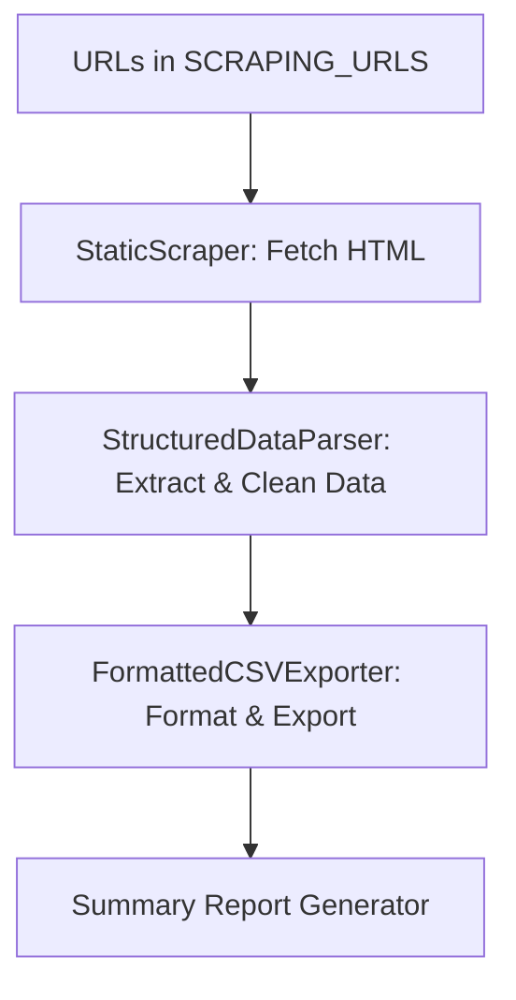

# 🕸️ Advanced Multi-URL Web Scraper with Enhanced CSV Formatting

A **powerful and modular web scraper** designed for **multi-URL scraping** with **clean, structured CSV output**.  
This project is built for **data analysts, researchers, and developers** who need organized data from multiple sources — all formatted neatly for immediate analysis.

---

## 🚀 Features

✅ **Multi-URL Scraping**
- Easily scrape multiple web pages by editing a single configuration list.

✅ **Structured CSV Output**
- Automatically organizes extracted data (tables, lists, sections, versions) into readable, formatted CSV files.

✅ **Smart Data Categorization**
- Extracts and categorizes:
  - Tables (`table_data`)
  - Lists (`list_item`)
  - Section Content (`section_content`)
  - Version Information (`version_info`)

✅ **Automatic Summary Reports**
- Generates a summary CSV with stats for URLs, data types, and scraping success rates.

✅ **Built-in Logging**
- Tracks scraping progress and errors in both the console and `scraper.log`.

✅ **Simple Configuration**
- Modify only one list (`SCRAPING_URLS`) to add or remove target websites.

---

## 📂 Output Structure

| File | Description |
|------|--------------|
| `software_versions_data.csv` | Combined structured data |
| `software_versions_data_table_data.csv` | Extracted HTML tables |
| `software_versions_data_list_item.csv` | List items from `<ul>` and `<ol>` |
| `software_versions_data_section_content.csv` | Headings and content sections |
| `software_versions_data_version_info.csv` | Version numbers and release info |
| `software_versions_data_summary.csv` | Summary of scraping stats |

---

## ⚙️ Installation

### Prerequisites
- Python 3.8+
- `pip` package manager

### 1. Clone the Repository
```bash
git clone https://github.com/yourusername/advanced-multiurl-webscraper.git
cd advanced-multiurl-webscraper
```

### 2. Install Dependencies
```bash
pip install -r requirements.txt
```

### 3. (Optional) Create a Virtual Environment
```bash
python -m venv venv
source venv/bin/activate    # For Linux/macOS
venv\Scripts\activate       # For Windows
```

---

## 🧠 Usage

### 1. Add Your Target URLs
Edit the list `SCRAPING_URLS` at the top of the script:

```python
SCRAPING_URLS = [
    'https://www.dbf2002.com/news.html',
    'https://example.com/software/releases',
]
```

### 2. Run the Scraper
```bash
python scraper.py
```

### 3. View the Results
After execution, check the project folder for your CSV files:
```
software_versions_data.csv
software_versions_data_summary.csv
```

---

## 📊 Example Output

| record_id | data_type | source_url | domain | extraction_timestamp | version_number | context | full_text |
|------------|------------|------------|--------|----------------------|----------------|----------|------------|
| 0001_001   | version_info | https://www.dbf2002.com/news.html | dbf2002.com | 2025-10-11T12:35:00 | v1.2.3 | Table_2 | Latest release version v1.2.3 now available... |

---

## 🧩 Key Components

| Component | Description |
|------------|--------------|
| `StructuredDataParser` | Extracts structured content (tables, lists, sections, versions) |
| `FormattedCSVExporter` | Creates readable, consistent CSVs |
| `FormattedScraper` | Main engine for scraping and report generation |
| `ScraperLogger` | Handles console and file logging |
| `StaticScraper` | Lightweight static HTML fetcher for compatibility |

---

## 🧱 Architecture Overview



---

## 🪶 Example Configuration Snippet

```python
# Configuration: Only edit this section
SCRAPING_URLS = [
    'https://www.dbf2002.com/news.html',
]
DEFAULT_OUTPUT_FILENAME = "software_versions_data"
USE_ASYNC_MODE = False
```

---

## 🛡️ Error Handling & Logging

- All scraping errors are logged to `scraper.log`
- Automatic retries for failed requests
- Graceful handling of missing or malformed HTML

---

## 🧾 Summary Statistics in CSV

Each run includes a **summary file** with:

- Total URLs processed
- Success/failure rate
- Total extracted records
- Breakdown by data type

Example snippet:

| report_type | total_urls | successful_urls | failed_urls | total_records | success_rate | scraping_duration |
|--------------|-------------|------------------|--------------|----------------|---------------|------------------|
| OVERALL_SUMMARY | 5 | 4 | 1 | 240 | 80.0% | 22.4s |

---

## 🧰 Dependencies

- `httpx`
- `beautifulsoup4`
- `selenium`
- `webdriver-manager`
- `aiofiles` *(optional for async mode)*

Install them all via:

```bash
pip install httpx beautifulsoup4 selenium webdriver-manager aiofiles
```

---

## 👨‍💻 Author

**Don**  
🧩 Cybersecurity & AI Security Enthusiast  
💻 Focus: Automation, Data Extraction, and Security Research  
📫 Contact: [LinkedIn or GitHub profile link here]

---

## 🪪 License

This project is licensed under the **MIT License** — free to use, modify, and distribute with attribution.

---

## ⭐ Contribute

Pull requests and suggestions are welcome!  
If you encounter a bug or have an idea for improvement, open an issue on GitHub.

---

### 📈 Summary
This scraper is ideal for:
- **Security researchers** gathering software version info  
- **Data analysts** organizing structured site data  
- **Developers** automating static data collection workflows

---

> “Automate the boring stuff — and export it beautifully.” 🧠
